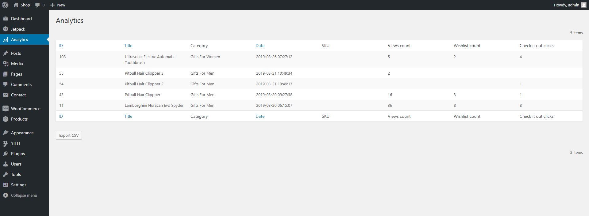

## Product Analytics for WooCommerce

#### Collects analytics of product impressions:

1. Views
2. Additions to wishlist
3. External link clicks

#### And collects the same information, but for each user:

#### Requirements:
1. WooCommerce
2. YITH wishlist